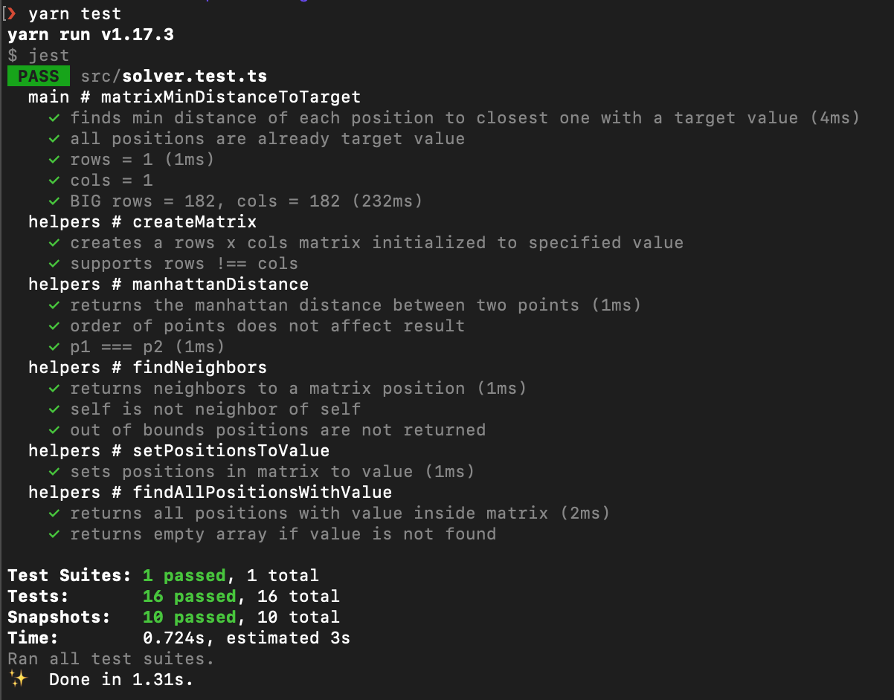

# Dott Code Challenge

## Task

There is given a rectangular bitmap of size n\*m. Each pixel of the bitmap is either white or black, but at least one is white. The pixel in i-th line and j-th column is called the pixel (i,j). The distance between two pixels p1=(i1,j1) and p2=(i2,j2) is defined as d(p1,p2)=|i1-i2|+|j1-j2|.

Write a program which:

- Reads the description of the bitmap from the standard input.
- For each pixel, computes the distance to the nearest white.
- writes the results to the standard output.

### Input

- The number of test cases t (1≤t≤1000) is in the first line of input.
- Then t test cases follow separated by an empty line.
- In the first line of each test case there is a pair of integer numbers n, m separated by a single space, 1<=n <=182, 1<=m<=182.
- In each of the following n lines of the test case exactly one zero-one word of length m, the description of one line of the bitmap, is written.
- On the j-th position in the line (i+1), 1 <= i <= n, 1 <= j <= m, is '1' if, and only if the pixel (i,j) is white.

```
1 // number of test cases
3 4 // line x column sizes
0001 // pixels - 0: black, 1: white
0011
0110
```

### Output

```
3210 // distances to the nearest white pixels
2100
1001
```

## Usage

### Running the code

1. Clone this Repository to your local machine.

   ```
   git clone https://github.com/GwamakaCharles/dott_challenge.git
   ```

2) Install dependencies

   ```
   yarn install
   ```

3) (OPTIONAL) Modify [input.txt](input.txt) with desired cases or use the defaults.

4) Execute the code that'll solve the test cases and output to console.

   ```
   yarn start
   ```

Note: You can also use the [Github Codespaces](https://codespaces.github.io/) to run the code.

### Running the test suite

    yarn test


